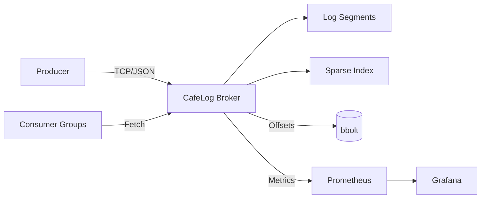

# ☕ CafeLog — Distributed Message Broker

> **Mini-Kafka en Go**: Message broker tipo commit-log con particionado, consumer groups, observabilidad completa y deployment listo para producción. Perfecto para **aprendizaje**, **prototipos** y **sistemas distribuidos**.

[](https://golang.org/)
[](https://docker.com)
[](https://prometheus.io/)
[](https://grafana.com/)
[](LICENSE)

---

## 🎯 **¿Qué es CafeLog?**

**CafeLog** es un **message broker distribuido** inspirado en Apache Kafka, diseñado para ser **simple, observable y production-ready**. Implementa un **commit-log particionado** con características empresariales como consumer groups, retención configurable y métricas detalladas.

### 🏆 **¿Por qué CafeLog?**

<div align="center">
<table>
<tr>
<td align="center">⚡<br><b>Alto Rendimiento</b><br>Append-only logs<br>con índices esparsos</td>
<td align="center">📊<br><b>Observabilidad</b><br>Prometheus + Grafana<br>dashboards incluidos</td>
<td align="center">🐳<br><b>Cloud Native</b><br>Docker multi-stage<br>Compose listo</td>
<td align="center">🎓<br><b>Educativo</b><br>Código limpio<br>para aprender</td>
</tr>
</table>
</div>

---

## 🚀 **Quick Start**

### 🐳 **Opción 1: Docker Compose (Recomendado)**

```bash
# Clonar y ejecutar stack completo
git clone https://github.com/Bay0312/cafelog.git
cd cafelog

# Levantar CafeLog + Prometheus + Grafana
docker compose up -d --build

# Verificar servicios
curl http://localhost:8080/healthz
```

**Servicios disponibles:**
- **CafeLog Broker:** http://localhost:8080
- **Prometheus:** http://localhost:9091  
- **Grafana:** http://localhost:3000 (admin/admin)

### 💻 **Opción 2: Desarrollo Local**

```bash
# Compilar desde fuentes
go build -o bin/broker ./cmd/broker

# Ejecutar broker
./bin/broker

# En otra terminal - verificar
curl -s localhost:8080/healthz
curl -s localhost:8080/metrics | head -20
```

---

## 🏗️ **Arquitectura del Sistema**

<div align="center">
<table>
<tr>
<th>🔧 Componente</th>
<th>📝 Tecnología</th>
<th>🎯 Propósito</th>
</tr>
<tr>
<td><b>Protocolo</b></td>
<td>TCP + JSON framing</td>
<td>Comunicación cliente-broker eficiente</td>
</tr>
<tr>
<td><b>Persistencia</b></td>
<td>Append-only segments</td>
<td>Durabilidad y replay de mensajes</td>
</tr>
<tr>
<td><b>Indexado</b></td>
<td>Índices esparsos (.idx)</td>
<td>Búsqueda rápida por offset</td>
</tr>
<tr>
<td><b>Consumer Groups</b></td>
<td>bbolt (embedded)</td>
<td>Gestión de offsets por grupo</td>
</tr>
<tr>
<td><b>Métricas</b></td>
<td>Prometheus</td>
<td>Observabilidad y alerting</td>
</tr>
<tr>
<td><b>Deployment</b></td>
<td>Docker multi-stage</td>
<td>Producción y desarrollo</td>
</tr>
</table>
</div>

### 🎨 **Flujo de Datos**



---

## 📋 **Roadmap y Estado Actual**

### ✅ **Estado Actual**
- **HTTP Server** funcionando (/healthz, /metrics)
- **TCP Server** levantando y aceptando conexiones
- **Framework de métricas** Prometheus configurado
- **Docker stack** completo con observabilidad

### 🎯 **Hitos de Desarrollo**

<div align="center">
<table>
<tr>
<th>🏁 Hito</th>
<th>📋 Características</th>
<th>🚦 Estado</th>
<th>📅 ETA</th>
</tr>
<tr>
<td><b>Hito 0</b><br>MVP Protocolo</td>
<td>CREATE_TOPIC, PRODUCE, FETCH, COMMIT</td>
<td>🟡 En Progreso</td>
<td>Q1 2025</td>
</tr>
<tr>
<td><b>Hito 1</b><br>Log Particionado</td>
<td>Segmentos .log/.idx + CLI demo</td>
<td>📋 Planeado</td>
<td>Q2 2025</td>
</tr>
<tr>
<td><b>Hito 2</b><br>Consumer Groups</td>
<td>Offsets bbolt + retención + métricas</td>
<td>📋 Planeado</td>
<td>Q2 2025</td>
</tr>
<tr>
<td><b>Hito 3</b><br>Observabilidad</td>
<td>Dashboards Grafana + Docker multi-stage</td>
<td>📋 Planeado</td>
<td>Q3 2025</td>
</tr>
<tr>
<td><b>Hito 4</b><br>Características Avanzadas</td>
<td>Delay Queue + JSON Schema + DLQ</td>
<td>💡 Opcional</td>
<td>Q4 2025</td>
</tr>
</table>
</div>

---

## ⚡ **Características Principales**

### 🎛️ **Core Features**

#### 📨 **Sistema de Mensajería**
- **Temas particionados** con distribución por hash de clave
- **Garantías at-least-once** de entrega
- **Append-only commit log** para durabilidad máxima

#### 👥 **Consumer Groups**
- **Gestión automática de offsets** por grupo y partición
- **Replay desde cualquier punto** del log
- **Balanceo manual** de particiones (v0.1)

#### ⏰ **Retención Inteligente**
- **Por tamaño**: rotación automática de segmentos
- **Por tiempo**: eliminación de datos expirados
- **Configuración por tema** independiente

#### 📊 **Observabilidad Completa**
- **Métricas Prometheus** con 15+ indicadores clave
- **Dashboards Grafana** preconstruidos
- **Health checks** HTTP listos para orquestadores

### 🚀 **Características Avanzadas (v0.1.1)**

#### ⏳ **Delay/Scheduled Messages**
- **Cola de mensajes diferidos** con min-heap por partición
- **Scheduling preciso** con ticker interno
- **Casos de uso**: notificaciones, eventos programados

#### 🔍 **Validación JSON Schema**
- **Validación automática** de mensajes por tema
- **Dead Letter Queue (DLQ)** para mensajes inválidos
- **Configuración declarativa** vía YAML

---

## 📂 **Arquitectura del Código**

<details>
<summary><b>🗂️ Ver estructura completa del proyecto</b></summary>

```
cafelog/
├── 🚀 Entry Points
│   └── cmd/broker/main.go              # Arranque principal: HTTP + TCP
│
├── 🏗️ Core Implementation
│   └── internal/
│       ├── proto/frame.go              # 📡 Protocolo TCP binario + JSON
│       ├── broker/broker.go            # 🔄 Loop TCP + dispatch de frames
│       ├── topic/partition.go          # 🗂️ Hash routing + operaciones
│       ├── log/
│       │   ├── segment.go              # 📝 Append, flush, rotate
│       │   └── index.go                # 🔍 Índice esparso offset→pos
│       ├── offsets/store.go            # 💾 bbolt para consumer groups
│       ├── sched/delay.go              # ⏰ Min-heap para delay queue
│       ├── schema/validate.go          # ✅ Validación JSON Schema
│       └── metrics/metrics.go          # 📊 Registry Prometheus
│
├── 🌐 Public APIs
│   └── pkg/api/http.go                 # HTTP endpoints (/healthz, /metrics)
│
├── ⚙️ Configuration
│   ├── configs/
│   │   ├── topics.yml                  # 📋 Declaración de temas
│   │   └── schemas/                    # 📐 JSON Schemas por tema
│   │
├── 🐳 Deployment
│   ├── deploy/
│   │   ├── prometheus.yml              # 📊 Config Prometheus
│   │   └── grafana/
│   │       ├── dashboards/             # 📈 Dashboards .json
│   │       └── provisioning/           # 🔧 Auto-provisioning
│   ├── Dockerfile                      # 🐳 Multi-stage build
│   └── compose.yaml                    # 🚀 Stack completo
│
├── 🛠️ Development Tools
│   ├── scripts/
│   │   ├── brokerctl/                  # 🎛️ CLI de administración
│   │   └── benchmark/                  # ⚡ Herramientas de carga
│   │
├── 💾 Runtime Data
│   └── data/                           # 📁 Segmentos (gitignored)
│       ├── topic-name/
│       │   └── partition-0/
│       │       ├── 000001.log          # 📝 Segmento de datos
│       │       └── 000001.idx          # 🔍 Índice esparso
│       └── offsets.db                  # 💾 bbolt consumer offsets
│
└── 🔧 DevOps
    ├── .github/workflows/ci.yaml       # 🤖 CI/CD GitHub Actions
    └── .dockerignore                   # 🐳 Optimización builds
```

</details>

---

## 🔌 **Protocolo de Red**

### 📡 **Frame Format**
```
┌─────────┬──────────────┬────────────────────┐
│ Type    │ Length       │ JSON Payload       │
│ uint8   │ uint32 (BE)  │ []byte             │
└─────────┴──────────────┴────────────────────┘
```

### 🎯 **Message Types**
| Tipo | Valor | Operación | Descripción |
|------|-------|-----------|-------------|
| **CREATE_TOPIC** | 1 | Gestión | Crear tema con N particiones |
| **PRODUCE** | 2 | Escritura | Enviar mensaje a partición |
| **FETCH** | 3 | Lectura | Obtener mensajes desde offset |
| **COMMIT** | 4 | Consumer | Confirmar offset procesado |
| **HEARTBEAT** | 5 | Monitor | Keep-alive del consumer |

### 📋 **Record Format (JSON)**
```json
{
  "key": "dXNlcklk",           // base64: clave para particionado
  "value": "SGVsbG8gV29ybGQ=",   // base64: payload del mensaje
  "ts": 1704067200000,         // timestamp Unix ms
  "dueAt": 1704070800000       // opcional: para delay queue
}
```

### 🔄 **Operaciones Principales**

<details>
<summary><b>📨 PRODUCE - Enviar mensaje</b></summary>

```json
{
  "topic": "user-events",
  "partition": 0,           // -1 para auto-select por hash
  "records": [
    {
      "key": "dXNlcjEyMw==",  // "user123" en base64
      "value": "eyJhY3Rpb24iOiJsb2dpbiJ9", // JSON payload
      "ts": 1704067200000
    }
  ]
}
```

</details>

<details>
<summary><b>📥 FETCH - Obtener mensajes</b></summary>

```json
{
  "topic": "user-events",
  "partition": 0,
  "offset": 100,           // -1=latest, 0=from-beginning
  "maxBytes": 1048576,     // 1MB máximo
  "maxWaitMs": 5000        // long-polling timeout
}
```

</details>

<details>
<summary><b>✅ COMMIT - Confirmar offset</b></summary>

```json
{
  "topic": "user-events",
  "partition": 0,
  "group": "analytics-service",
  "offset": 150            // próximo offset a leer
}
```

</details>

---

## 🐳 **Deployment y Configuración**

### ⚙️ **Variables de Entorno**

| Variable | Default | Descripción |
|----------|---------|-------------|
| `CAFELOG_HTTP_ADDR` | `:8080` | Puerto HTTP (health/metrics) |
| `CAFELOG_TCP_ADDR` | `:7070` | Puerto TCP (broker protocol) |
| `CAFELOG_DATA_DIR` | `./data` | Directorio de persistencia |
| `CAFELOG_LOG_LEVEL` | `info` | Nivel de logging |

### 📋 **Configuración de Temas (configs/topics.yml)**

```yaml
topics:
  - name: "user-events"
    partitions: 4
    retention:
      bytes: "1GB"
      ms: "7d"
    
  - name: "order-processing" 
    partitions: 8
    retention:
      bytes: "512MB"
      ms: "24h"
```

### 🐳 **Docker Compose Personalizado**

```yaml
version: '3.8'
services:
  cafelog:
    build: .
    ports:
      - "8080:8080"
      - "7070:7070"
    environment:
      - CAFELOG_LOG_LEVEL=debug
    volumes:
      - ./data:/app/data
      - ./configs:/app/configs
    
  prometheus:
    image: prom/prometheus:latest
    ports:
      - "9091:9090"
    volumes:
      - ./deploy/prometheus.yml:/etc/prometheus/prometheus.yml
```

---

## 📊 **Métricas y Observabilidad**

### 🎯 **Métricas Clave**

<div align="center">
<table>
<tr>
<th>📊 Métrica</th>
<th>🏷️ Tipo</th>
<th>📝 Descripción</th>
</tr>
<tr>
<td><code>cafelog_messages_total</code></td>
<td>Counter</td>
<td>Mensajes por topic/partition/dirección</td>
</tr>
<tr>
<td><code>cafelog_bytes_total</code></td>
<td>Counter</td>
<td>Bytes transferidos por endpoint</td>
</tr>
<tr>
<td><code>cafelog_consumer_lag</code></td>
<td>Gauge</td>
<td>Retraso de consumer groups</td>
</tr>
<tr>
<td><code>cafelog_publish_latency_ms</code></td>
<td>Histogram</td>
<td>Latencia de publicación (P50, P95, P99)</td>
</tr>
<tr>
<td><code>cafelog_errors_total</code></td>
<td>Counter</td>
<td>Errores por tipo</td>
</tr>
<tr>
<td><code>cafelog_scheduled_inflight</code></td>
<td>Gauge</td>
<td>Mensajes en delay queue</td>
</tr>
</table>
</div>

### 📈 **Dashboards Incluidos**

- **📊 Broker Overview**: Throughput, latencia, errores
- **🎯 Topic Details**: Métricas por tema y partición  
- **👥 Consumer Groups**: Lag, offsets, rendimiento
- **🔧 System Health**: Memoria, CPU, red, storage

### 🚨 **Alertas Sugeridas**

```yaml
# Ejemplo Prometheus alerts
groups:
  - name: cafelog
    rules:
      - alert: HighConsumerLag
        expr: cafelog_consumer_lag > 10000
        for: 5m
        labels:
          severity: warning
        annotations:
          summary: "Consumer lag alto en {{ $labels.topic }}"
```

---

## ⚠️ **Manejo de Errores**

### 🚫 **Códigos de Error Estándar**

| Código | Descripción | Acción Recomendada |
|--------|-------------|-------------------|
| `UNKNOWN_TOPIC_OR_PARTITION` | Tema/partición no existe | Crear tema primero |
| `OFFSET_OUT_OF_RANGE` | Offset inválido o expirado | Usar offset válido |
| `SCHEMA_VALIDATION_FAILED` | Mensaje no cumple schema | Revisar formato |
| `INTERNAL_IO_ERROR` | Error de persistencia | Verificar permisos/espacio |
| `INVALID_REQUEST` | Frame/payload malformado | Revisar protocolo |

### 🔧 **Estrategias de Recovery**

- **Reconexión automática** con backoff exponencial
- **Retry logic** para errores transitorios  
- **Circuit breakers** para fallos sistemáticos
- **Dead letter queues** para mensajes irrecuperables

---

## 🧪 **Ejemplos de Uso**

<details>
<summary><b>🔨 Ejemplo básico con brokerctl CLI</b></summary>

```bash
# Crear tema
./brokerctl topic create user-events --partitions 4

# Producir mensajes  
echo '{"userId": "123", "action": "login"}' | \
  ./brokerctl produce user-events --key "user123"

# Consumir desde inicio
./brokerctl consume user-events --group analytics --from-beginning

# Monitorear lag de consumer
./brokerctl consumer lag analytics
```

</details>

<details>
<summary><b>🐳 Stack completo para desarrollo</b></summary>

```bash
# Levantar todo el stack
docker compose -f compose.dev.yaml up -d

# Generar carga de prueba
./scripts/benchmark/load-test.sh --topics 5 --rate 1000msg/s

# Ver métricas en tiempo real
watch -n1 'curl -s localhost:8080/metrics | grep cafelog_messages'

# Dashboards automáticos
open http://localhost:3000/d/cafelog-overview
```

</details>

---

## 🤝 **Contribuir al Proyecto**

### 🛠️ **Setup de Desarrollo**

```bash
# Fork y clonar
git clone https://github.com/Bay0312/cafelog.git
cd cafelog

# Instalar dependencias
go mod download

# Ejecutar tests
go test ./...

# Linter y formato
go fmt ./...
go vet ./...
```

### 📋 **Guía de Contribución**

1. **🍴 Fork** el repositorio
2. **🌟 Crear feature branch** (`git checkout -b feat/nueva-caracteristica`)
3. **📝 Commit cambios** usando [Conventional Commits](https://conventionalcommits.org/)
4. **🧪 Añadir tests** para nueva funcionalidad
5. **📊 Actualizar métricas** si corresponde
6. **📖 Actualizar documentación**
7. **🚀 Abrir Pull Request** con descripción detallada

### 💡 **Ideas de Contribución**

- **🔐 Autenticación**: JWT/mTLS para producción
- **📈 Scaling**: Replicación multi-nodo  
- **☁️ Cloud**: Helm charts para Kubernetes
- **🔍 Observabilidad**: OpenTelemetry tracing
- **⚡ Performance**: Optimizaciones de throughput

---

## 📄 **Licencia y Créditos**

### 📝 **Licencia MIT**
Proyecto open source bajo **MIT License**. Ver [LICENSE](LICENSE) para detalles completos.

### 🙏 **Inspiración y Referencias**
- **Apache Kafka**: Diseño de commit-log y semanticas
- **NATS**: Simplicidad del protocolo  
- **Redis**: Eficiencia de estructuras de datos
- **Prometheus**: Métricas y observabilidad

---

<div align="center">

## 🎯 **¿Listo para distribuir mensajes?**

### **[🚀 Comenzar Ahora](https://github.com/Bay0312/cafelog)**

---

### 💫 **Desarrollado con pasión por sistemas distribuidos**

**Go • Message Queues • Observability • Cloud Native**

[](https://github.com/Bay0312/cafelog)

</div>
